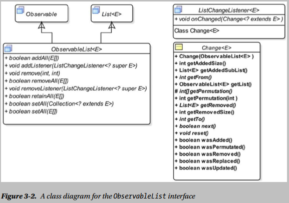
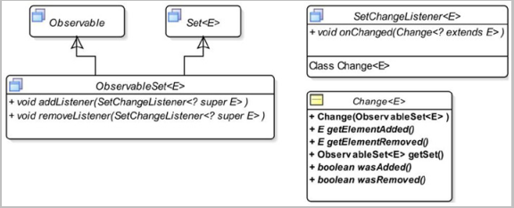
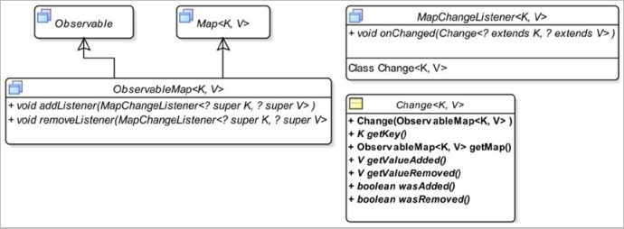

## Notes

### 1. Understanding ObservableList

* an observable collection in JavaFX is a list, set, or map that may be observed for invalidation and content changes

* In the case of the ObservableList, the invalidation listeners are notified for every change in the list, irrespective of the type of a change.



##### Understanding the ListChangeListener.Change Class

* A Change object contains a cursor that points to a specific change in the report. The ```next()``` and ```reset()``` methods are used to control the cursor. When the ```onChanged()``` method is called, the cursor points before the first change in the report. Calling the ```next()``` method the first time moves the cursor to the first change in the report. Before attempting to read the details for a change, you must point the cursor to the change by calling the ```next()``` method. The ```next()``` method returns true if it moves the cursor to a valid change. Otherwise, it returns false. The reset() method moves the cursor before the first change. Typically, the next() method is called in a while-loop, as shown in the following snippet of code:

    ```Java
      ObservableList<String> list = FXCollections.observableArrayList();
      ...
      // Add a change listener to the list
      list.addListener(new ListChangeListener<String>() {
          @Override
          public void onChanged(ListChangeListener.Change<? extends String> change) {
              while(change.next()) {
              // Process the current change here...
              }
          }
      });
    ```

* Not all five types of changes to a list are exclusive. Some changes may occur simultaneously in the same change notification. The two types of changes, permutations and updates, are exclusive. If you are interested in working with all types of changes, your code in the onChanged() method should look as follows:
    ```java
        public void onChanged(ListChangeListener.Change change) {

            while (change.next()) {

                if (change.wasPermutated()) {
                // Handle permutations
                }
                else if (change.wasUpdated()) {
                // Handle updates
                }
                else if (change.wasReplaced()) {
                // Handle replacements
                }
                else {
                    if (change.wasRemoved()) {
                    // Handle removals
                    }
                    else if (change.wasAdded()) {
                    // Handle additions
                    }
                }
            }
        }
    ```

* In the affected range type category, the ```getFrom()``` and ```getTo()``` methods report the range of indexes affected by a change. The ```getFrom()``` method returns the beginning index and the ```getTo()``` method returns the ending index plus one.
    * If the ```wasPermutated()``` method returns true, the range includes the elements that were permutated.
    * If the ```wasUpdated()``` method returns true, the range includes the elements that were updated.
    * If the ```wasAdded()``` method returns true, the range includes the elements that were added.
    * If the ```wasRemoved()``` method returns true and the ```wasAdded()``` method returns false, the ```getFrom()``` and ```getTo()``` methods return the same number—the index where the removed elements were placed in the list.


* JavaFX library provides two classes named ```FilteredList``` and ```SortedList``` that are in the __javafx.collections.transformation__ package. A ```FilteredList``` is an ```ObservableList``` that filters its contents using a specified Predicate. A ```SortedList``` sorts its contents. All discussions of observable lists apply to the objects of these classes as well.


##### Observing an ObservableList for Updates

* the following two methods of the FXCollections class that create an ObservableList:
    * ```<E> ObservableList<E> observableArrayList(Callback<E, Observable[]> extractor)```
    * ```<E> ObservableList<E> observableList(List<E> list, Callback<E, Observable[]> extractor)```

    If you want to be notified when elements of a list are updated, you need to create the list using one of these methods. Both methods have one thing in common: They take a ```Callback<E,Observable[]>``` object as an argument. The ```Callback<P,R>``` interface is in the __javafx.util__ package. It is defined as follows:
    ```java
        public interface Callback<P,R> {
            R call(P param);
        }
    ```

* Let’s examine why you need a Callback object and an Observable array to detect updates to elements of a list. A list stores references of its elements. Its elements can be updated using their references from anywhere in the program. A list does not know that its elements are being updated from somewhere else. It needs to know the list of Observable objects, where a change to any of them may be considered an update to its elements. The call() method of the Callback object fulfills this requirement. The list passes every element to the call() method. The call() method returns an array of Observable. The list watches for any changes to the elements of the Observable array. When it detects a change, it notifies its change listeners that its element associated with the Observable array has been updated. The reason this parameter is named extractor is that it extracts an array of Observable for an element of a list.
    ```java
    class Person {
        private StringProperty firstName = new SimpleStringProperty();
        private StringProperty lastName = new SimpleStringProperty();

        public Person(String firstName, String lastName) {
            this.firstName.set(firstName);
            this.lastName.set(lastName);
        }

        public StringProperty firstNameProperty() {
            return firstName;
        }

        public StringProperty lastNameProperty() {
            return lastName;
        }
    }
    public class Test {
        public static void main(String[] args) {
            Callback<Person, Observable[]> cb = new Callback<Person, Observable[]>() {
                @Override
                public Observable[] call(Person param) {
                    return new Observable[]{param.firstNameProperty(), param.lastNameProperty()};
                }
            };

            ObservableList<Person> list = FXCollections.observableArrayList(cb);
        }
    }
    ```

### 2. Understanding ObservableSet




### 3. Understanding ObservableMap


