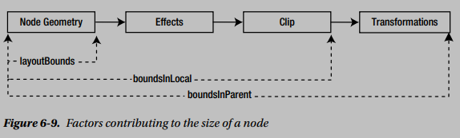
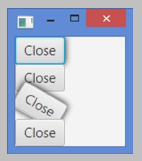

## Notes

* A scene graph is a tree data structure. Every item in a scene graph is called a node. An instance of the javafx.scene.Node class represents a node in the scene graph. Note that the Node class is an abstract class, and several concrete classes exist to represent specific type of nodes.

* A node may be created and modified on any thread if it is not yet attached to a scene. Attaching a node to a scene and subsequent modification must occur on the JavaFX Application Thread.

* Every node has a geometric shape and it is positioned in a coordinate space. The size and the position of a node are collectively known as its bounds. The bounds of a node are defined in terms of a bounding rectangular box that encloses the entire geometry of the node.

* The Bounds class contains isEmpty(), contains(), and intersects() utility methods. The isEmpty() method returns true if any of the three dimensions (width, height, or depth) of a Bounds is negative. The contains() method lets you check if a Bounds contains another Bounds, a 2D point, or a 3D point. The intersects() method lets you check if the interior of a Bounds intersects the interior of another Bounds, a 2D point, or a 3D point.

* A node in a scene graph has three types of bounds defined as three read-only properties in the Node class:
    1. layoutBounds
    1. boundsInLocal
    1. boundsInParent  

    The boundsInLocal and BoundsInParent are known as physical or visual bounds as they correspond to how the node looks visually. The layoutBounds is also known as the logical bounds as it does not necessarily correspond to the physical bounds of the node. All bounds of a node use local coordinate system of that node.

    

* Containers allocate spaces to lay out child nodes based on their layoutBounds.

    

* Sometimes you may want to include the space needed to show the effects and transformations of a node in its layoutBounds. The solution for this is easy. You need to wrap the node in a Group and the Group in a container. Now the container will query the Group for its layoutBounds. The layoutBounds of a Group is the union of the boundsInParent for all its children.

    

* The layoutBounds of a node is computed based on the geometric properties of a node. Therefore, you should not bind such properties of a node to an expression that includes the layoutBounds of the node.

***

##### Bounds of a Group

1. The layoutBounds of a Group is the union of the boundsInParent of all its children. It includes effects, clip, and transformations applied directly to the children. It does not include effects, clip, and transformations applied directly to the Group.

1.  The boundsInLocal of a Group is computed by taking its layoutBounds and including the effects and clip applied directly to the Group.

1. The boundsInParent of a Group is computed by taking its boundsInLocal and including the transformations applied directly to the Group.

1. When you want to allocate space for a node that should include effects, clip, and transformations, you need to try wrapping the node in a Group.

***

* The Node class has a convenience method, ```relocate(double finalX, double finalY)```, to position the node at the (finalX, finalY) location. The method computes and sets the layoutX and layoutY values correctly, taking into account the minX and minY values of the layoutBounds. To avoid errors and misplacement of nodes, I prefer using the ```relocate()``` method over the ```setLayoutX()``` and ```setLayoutY()``` methods.

* ```relocate()```, ```setLayoutX()```,```setLayoutY()``` all these methods use the __parent coordinate__, not local coordinate.

* Sometimes setting the layoutX and layoutY properties of a node may not position them at the desired location inside its parent. If you are caught in this situation, check the parent type. Most parents, which are the subclasses of the Region class, use their own positioning policy, ignoring the layoutX and layoutY settings of their children. For example, HBox and VBox use their own positioning policy and they will ignore the layoutX and layoutY values for their children.

* If you want to have full control on positioning a node within its parent, use a Pane or a Group. A Pane is a Region, which does not position its children. You will need to position the children using the layoutX and layoutY properties.

* A resizable node can be resized by its parent during a layout. A nonresizable node is not resized by its parent during a layout. If you want to resize a nonresizable node, you need to modify its properties that affect its size. For example, to resize a rectangle, you need to change its width and height properties. Regions, Controls, and WebView are examples of resizable nodes. Group, Text, and Shapes are examples of nonresizable nodes.

* How do you know if a node is resizable? The isResizable() method in the Node class returns true for a resizable node; it returns false for a nonresizable node.

*  For most nodes in JavaFX, width and height are independent. However, for some nodes, the height depends on the width and vice versa. When the width of a node depends on its height or vice versa, the node is said to have a content bias. If the height of a node depends on its width, the node has a horizontal content bias. If the width of a node depends on its height, the node has a vertical content bias. Note that a node cannot have both horizontal and vertical content biases, which will lead to a circular dependency. The getContentBias() method of the Node class returns the content bias of a node. Its return type is the javafx.geometry.Orientation enum type, which has two constants: HORIZONTAL and VERTICAL. If a node does not have a content bias, for example, Text or ChoiceBox, the method returns null.

* There are several size-related methods defined in the Node class. Those methods have no effect when they are called on nonresizable nodes or they return their current size. For example, calling the resize(double w, double h) method of the Node class on a nonresizable node has no effect.

* Nonresizable nodes do not have content bias.

***

##### Storing User Data in a Node

* Every node maintains an observable map of user-defined properties (key/value pairs). You can use it to store any useful information. The ```getProperties()``` method of the Node class returns an ```ObservableMap<Object, Object>``` in which you can add or remove properties for the node. The following snippet of code adds a property
"originalData" with a value "Advik" to a TextField node:
    ```java
    TextField nameField = new TextField();
    ...
    ObservableMap<Object, Object> props = nameField.getProperties();
    props.put("originalData", "Advik");

    if (props.containsKey("originalData")) {
    String originalData = (String)props.get("originalData");
    } else {
    // originalData property is not set yet
    }
    ```

* The Node class has two convenience methods, ```setUserData(Object value)``` and ```getUserData()```, to store a user-defined value as a property for a node.
    ```java
    TextField nameField = new TextField();
    ...
    nameField.setUserData("Saved"); // Set the user data
    ...
    String userData = (String)nameField.getUserData(); // Get the user data
    ```

* You cannot access the user data of a node directly except by using the ```getUserData()``` method. Because it is stored in the same ObservableMap returned by the ```getProperties()``` method, you can get to it indirectly by iterating through the values in that map

* The Node class has a ```hasProperties()``` method. It tests if a node has properties or has userData.

***

* The Node class has a managed property, which is of type BooleanProperty. By default, all nodes are managed. The laying out of a managed node is managed by its parent. A Parent node takes into account the layoutBounds of all its managed children when it computes its own size. A Parent node is responsible for resizing its managed resizable children and positioning them according to its layout policy. When the layoutBounds of a managed child changes, the relevant part of the scene graph is relaid out.

* Contrast the visible property of the Node class with its managed property. A Parent node takes into account the layoutBounds of all its invisible children for layout purposes and ignores the unmanaged children.

***

##### Transforming Bounds between Coordinate Spaces

* I have already covered coordinate spaces used by nodes. Sometimes you may need to translate a Bounds or a point from one coordinate space to another. The Node class contains several methods to support this. The following transformations of a Bounds or a point are supported:

    * __localToParent()__ method transforms a Bounds or a point in the local coordinate space of a node to the coordinate space of its parent.
    * __localToScene()__ method transforms a Bounds or a point in the local coordinate space of a node to the coordinate space of its scene.
    * __parentToLocal()__ method transforms a Bounds or a point in the coordinate space of the parent of a node to the local coordinate space of the node.
    * __sceneToLocal()__ method transforms a Bounds or a point in the coordinate space of the scene of a node to the local coordinate space of the node.

    All methods have three overloaded versions; one version takes a Bounds as an argument and returns the transformed Bounds; another version takes a Point2D as an argument and returns the transformed Point2D; another version takes the x and y coordinates of a point and returns the transformed Point2D.

* Steps to relocate a node with respect to other node:
    1. get the MinX & MinY from the layoutBound of the respected node.
    2. transform the coordinate from local to scene using __localToScene()__ method of the respected node object. Transforming to scene coordinate because scene coordinate is common to all node.
    3. transform the coordinate from scene to local using __sceneToLocal()__ method of the node that would be relocated.
    4. transform the coordinate from local to parent using __parentToLocal()__ method of the node that would be relocated. Transforming to parent coordinate because the __relocate()__ method takes the point of parent coordinate.
    5. now you have the point. use this point to relocate the node using __relocate()__ method of the node that would be relocated.
    ```java
    // here newNode= respected node &
    // marker = node that would be relocated    
    // step-1
    double nodeMinX = newNode.getLayoutBounds().getMinX();
    double nodeMinY = newNode.getLayoutBounds().getMinY();
    // step-2
    Point2D nodeInScene = newNode.localToScene(nodeMinX, nodeMinY);
    // step-3
    Point2D nodeInMarkerLocal = marker.sceneToLocal(nodeInScene);
    // step-4
    Point2D nodeInMarkerParent = marker.localToParent(nodeInMarkerLocal);
    // step-5
    marker.relocate(nodeInMarkerParent.getX(), nodeInMarkerParent.getY());
    ```
