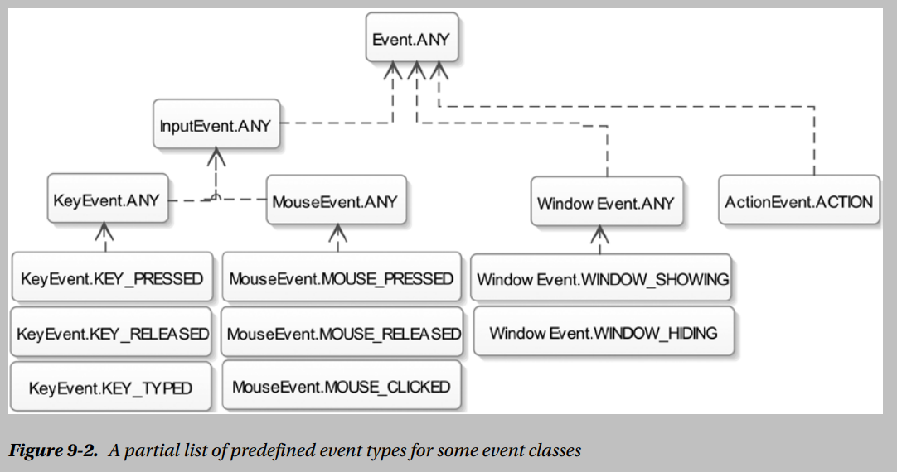

## Notes

* In general, the term event is used to describe an occurrence of interest. In a GUI application, an event is an occurrence of a user interaction with the application.

* An event in JavaFX is represented by an object of the javafx.event.Event class or any of its subclasses. Every event in JavaFX has three properties:
    1. __An event source :__ The UI element that calls event handlers is the source of the event for those event handlers. When an event occurs, it passes through a chain of event dispatchers. The source of an event is the current element in the event dispatcher chain. The event source changes as the event passes through one dispatcher to another in the event dispatcher chain.

    1. __An event target :__ The event target is the destination of an event. The event target determines the route through which the event travels during its processing.

    1. __An event type :__ The event type describes the type of the event that occurs. Event types are defines in a hierarchical fashion. Each event type has a name and a supertype.

* The piece of code that is executed in response to an event is known as an __event handler__ or an __event filter__.

* in JavaFX, implementing the EventTarget interface makes a UI element eligible to be an event target. The Window, Scene, and Node classes implement the EventTarget interface. The classes for some UI elements, for example, Tab, TreeItem, and MenuItem, do not inherit from the Node class. They can still respond to events because they implement the EventTarget interface.

***

##### Event Types

* An instance of the ```EventType``` class defines an event type. The ```EventType``` class is a generic class whose type parameter is defined as follows:
    ```java
    EventType<T extends Event>
    ```

* Event types are hierarchical. They are hierarchical by implementation, not by class inheritance. Each event type has a name and a supertype. The getName() and getSuperType() methods in the EventType class return the name and supertype of an event type. The constant Event.ANY, which is the same as the constant EventType.ROOT, is the supertype of all events in JavaFX. Figure 9-2 shows a partial list of some event types that have been predefined in some event classes.

    

    Note that the arrows in the diagram do not denote class inheritance. They denote dependencies. For example, the InputEvent.ANY event type depends on the Event.ANY event type, as the latter is the supertype of the former.

    An event class, which has subevent types, defines an ANY event type. For example, the MouseEvent class defines an ANY event type that represents a mouse event of any type.

***

##### Event Processing Mechanism

* When an event occurs, several steps are performed as part of the event processing:
    1. Event target selection
    1. Event route construction
    1. Event route traversal

* __Event target selection__: When an action occurs, the system determines which node is the target based on internal rules:
    1. For key events, the target is the node that has focus.
    1. For mouse events, the target is the node at the location of the cursor. For synthesized mouse events, the touch point is considered the location of the cursor.
    1. For continuous gesture events that are generated by a gesture on a touch screen, the target is the node at the center point of all touches at the beginning of the gesture. For indirect gesture events that are generated by a gesture on something other than a touch screen, such as a trackpad, the target is the node at the location of the cursor.
    1. For swipe events that are generated by a swipe on a touch screen, the target is the node at the center of the entire path of all of the fingers. For indirect swipe events, the target is the node at the location of the cursor.
    1. For touch events, the default target for each touch point is the node at the location first pressed. A different target can be specified using the ungrab(), grab(), or grab(node) methods for a touch point in an event filter or event handler.

    If more than one node is located at the cursor or touch, the topmost node is considered the target.

* __Event route construction :__ The initial event route is determined by the event dispatch chain that was created in the implementation of the __buildEventDispatchChain()__ method of the selected event target. When a scene graph node is selected as an event target, the initial event route set in the default implementation of the __buildEventDispatchChain()__ method in the Node class is a path from the stage to itself.

###### Event Route Traversal

* An event route traversal consists of two phases:
    1. Capture phase
    1. Bubbling phase

* An event travels through each node in its route twice: once during the capture phase and once during the bubbling phase. You can register event filters and event handlers to a node for specific events types. The event filters and event handlers registered to a node are executed as the event passes through the node during the capture phase and the bubbling phase, respectively. The event filters and handlers are passed in the reference of the current node as the source of the event. As the event travels from one node to another, the event source keeps changing. However, the event target remains the same from the start to the finish of the event route traversal.

    During the route traversal, a node can consume the event in event filters or handlers, thus completing the processing of the event. Consuming an event is simply calling the ```consume()``` method on the event object. When an event is consumed, the event processing is stopped, even though some of the nodes in the route were not traversed at all.

* __Event Capturing Phase :__ In the event capturing phase, the event is dispatched by the root node of your application and passed down the event dispatch chain to the target node.

    If any node in the chain has an event filter registered for the type of event that occurred, that filter is called. When the filter completes, the event is passed to the next node down the chain. If a filter is not registered for a node, the event is passed to the next node down the chain. If no filter consumes the event, the event target eventually receives and processes the event.

* __Event Bubbling Phase :__ After the event target is reached and all registered filters have processed the event, the event returns along the dispatch chain from the target to the root node.

    If any node in the chain has a handler registered for the type of event encountered, that handler is called. When the handler completes, the event is returned to the next node up the chain. If a handler is not registered for a node, the event is returned to the next node up the chain. If no handler consumes the event, the root node eventually receives the event and processing is completed.

***
##### Handling Events
* [Working with Convenience Methods](https://docs.oracle.com/javase/8/javafx/events-tutorial/convenience_methods.htm)
* [Working with Event Filters](https://docs.oracle.com/javase/8/javafx/events-tutorial/filters.htm)
* [Working with Event Handlers](https://docs.oracle.com/javase/8/javafx/events-tutorial/handlers.htm)

* Execution Order of Event Filters and Handlers: There are some execution order rules for event filters and handlers for both similar and different nodes:
    1. Event filters are called before event handlers. Event filters are executed from the topmost parent to the event target in the parent-child order. Event handlers are executed in the reverse order of the event filters. That is, the execution of the event handlers starts at the event target and moves up in the child-parent order.

    1. For the same node, event filters and handlers for a specific event type are called before the event filters and handlers for generic types. Suppose you have registered event handlers to a node for ```MouseEvent.ANY``` and ```MouseEvent.MOUSE_CLICKED```. Event handlers for both event types are capable of handling mouse-clicked events. When the mouse is clicked on the node, the event handler for the ```MouseEvent.MOUSE_CLICKED``` event type is called before the event handler for the ```MouseEvent.ANY``` event type. Note that a mouse-pressed event and a mouse-released event occur before a mouse-clicked event occurs.

    1. The order in which the event filters and handlers for the same event type for a node are executed is not specified. There is one exception to this rule. Event handlers registered to a node using the ```addEventHandler()``` method are executed before the event handlers registered using the ```setOnXXX()``` convenience methods.

* A pop-up menu, also known as a context, contextual, or shortcut menu, is a menu that gives a user a set of choices that are available in a specific context in an application. For example, when you click the right mouse button in a browser on the Windows platform, a pop-up menu is displayed. Different platforms trigger pop-up menu events differently upon use of a mouse or keyboard. On the Windows platform, typically it is a right-mouse click or Shift + F10 key press.

    The isPopupTrigger() method returns true if the mouse event is the pop-up menu trigger event for the platform. Otherwise, it returns false. If you perform an action based on the returned value of this method, you need to use it in both mouse-pressed and mouse-released events. Typically, when this method returns true, you let the system display the default pop-up menu.

    JavaFX provides a context menu event that is a specific type of input event. It is represented by the ContextMenuEvent class in the javafx.scene.input package. If you want to handle context menu events, use ContextMenuEvent. Learn [More](https://docs.oracle.com/javase/8/javafx/api/javafx/scene/control/ContextMenu.html), [More](https://www.youtube.com/watch?v=dg0ZHIdRMe8)

* Read the ```Learn JavaFX 8``` to learn more about
    * __Handling Input Event__ : page 279
    * __Handling Mouse Event__ : page 280
    * __Handling Key Event__ : page 294
    * __Handling Window Event__ : page 299
