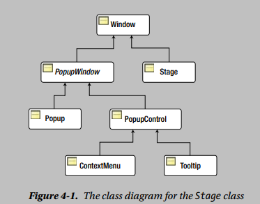

## Notes

### 1. Knowing the Details of Your Screens


  ```java
  // Get the reference to the primary screen
  Screen primaryScreen = Screen.getPrimary();
  //The static getScreens() method returns an ObservableList of Screen objects:
  ObservableList<Screen> screenList = Screen.getScreens();
  //You can get the resolution of a screen in DPI using the getDpi() method of the Screen class as follows:
  double dpi = primaryScreen.getDpi();
  ```

* You can use the ```getBounds()``` and ```getVisualBounds()``` methods to get the bounds and visual bounds, respectively. Both methods return a Rectangle2D object, which encapsulates the (x, y) coordinates of the upper-left and the lower-right corners, the width, and the height of a rectangle. The ```getMinX()``` and ```getMinY()``` methods return the x and y coordinates of the upper-left corner of the rectangle, respectively. The ```getMaxX()``` and ```getMaxY()``` methods return the x and y coordinates of the lower-right corner of the rectangle, respectively. The ```getWidth()``` and ```getHeight()``` methods return the width and height of the rectangle, respectively.

* Although it is not mentioned in the API documentation for the Screen class, you cannot use this class until the JavaFX launcher has started. That is, you cannot get screen descriptions in a non-JavaFX application. This is the reason that you would write the code in the ```start()``` method of a JavaFX application class. There is no requirement that the Screen class needs to be used on the JavaFX Application Thread. You could also write the same code in the ```init()``` method of your class.


### 2. Stage


*  stage in JavaFX is a top-level container that hosts a scene, which consists of visual elements. The Stage class in the javafx.stage package represents a stage in a JavaFX application. The primary stage is created by the platform and passed to the start(Stage s) method of the Application class. You can create additional stages as needed.

* A stage in a JavaFX application is a top-level container. This does not mean that it is always displayed as a separate window. For example, in a web environment, the primary stage of a JavaFX application is embedded inside the browser window.

* Figure 4-1 shows the class diagram for the Stage class, which inherits from the Window class.

    

* The ```close()``` method of the Stage class has the same effect as calling the ```hide()``` method of the Window class. The JavaFX API documentation does not mention that attempting to close a not showing window has no effect

* The bounds of a stage consist of four properties: x, y, width, and height. The x and y properties determine the location (or position) of the upper-left corner of the stage. The width and height properties determine its size.

* Let me recap the rules for positioning and resizing a stage. If you do not specify the bounds of a stage and:
    * It has no scene, its bounds are determined by the platform.
    * It has a scene with no visual nodes, its bounds are determined by the platform. In this case, the size of the scene is not specified.
    * It has a scene with some visual nodes, its bounds are determined by the visual nodes in the scene. In this case, the size of the scene is not specified and the stage is centered in the screen.
    * It has a scene and the size of the scene is specified, its bounds are determined by the specified size of the scene. The stage is centered on the screen.

    If you specify the size of the stage but not its position, the stage is sized according the set size and centered on the screen, irrespective of the presence of a scene and the size of the scene. If you specify the position of the stage (x, y coordinates), it is positioned accordingly.

    The default centering of a stage centers it horizontally on the screen.

* If you want to set the width and height of a stage to fit the content of its scene, use the ```sizeToScene()``` method of the Window class. The method is useful if you want to synchronize the size of a stage with the size of its scene after modifying the scene at runtime. Use the ```centerOnScreen()``` method of the Window class to center the stage on the screen.

##### Initializing the Style of a Stage

* In JavaFX, the style attribute of a stage determines its background color and decorations. Based on styles, you can have the following five types of stages in JavaFX:
    1. __Decorated :__ A decorated stage has a solid white background and platform decorations.
    1. __Undecorated :__ An undecorated stage has a solid white background and no decorations.
    1. __Transparent :__ A transparent stage has a transparent background and no decorations.
    1. __Utility :__ A utility stage has a solid white background and minimal platform decorations.
    1. __Unified :__  A unified stage has platform decorations and no border between the client area and decorations; the client area background is unified with the decorations. To see the effect of the unified stage style, the scene should be filled with ```Color.TRANSPARENT```. Unified style is a conditional feature.


* You can set the style of a stage using the ```initStyle(StageStyle style)``` method of the Stage class. The style of a stage must be set before it is shown for the first time. Setting it the second time, after the stage has been shown, throws a runtime exception. By default, a stage is decorated. The five types of styles for a stage are defined as five constants in the StageStyle enum:
    1. StageStyle.DECORATED
    1. StageStyle.UNDECORATED
    1. StageStyle.TRANSPARENT
    1. StageStyle.UNIFIED
    1. StageStyle.UTILITY


##### Initializing Modality of a Stage

* A Stage can have an owner. An owner of a Stage is another Window. You can set an owner of a Stage using the ```initOwner(Window owner)``` method of the Stage class. The owner of a Stage may be null, and in this case, it is said that the Stage does not have an owner. Setting an owner of a Stage creates an owner-owned relationship. For example, a Stage is minimized or hidden if its owner is minimized or hidden, respectively.

* In a GUI application, you can have two types of windows: modal and modeless. When a modal window is displayed, the user cannot work with other windows in the application until the modal window is dismissed. If an application has multiple modeless windows showing, the user can switch between them at any time. JavaFX has three types of modality for a stage. Modality of a stage is defined by one of the following three constants in the ```Modality``` enum in the javafx.stage package:
    1. ```NONE``` : The default modality of a Stage is NONE. When a Stage with the modality NONE is displayed, it does not block any other windows in the application. It behaves as a modeless window.
    1. ```WINDOW_MODAL```: A Stage with the WINDOW_MODAL modality blocks all windows in its owner hierarchy.
    1. ```APPLICATION_MODEL``` : If a Stage with its modality set to APPLICATION_MODAL is displayed, you must work with the Stage and dismiss it before you can work with any other windows in the application.


* The modality and the owner of a stage must be set before it is shown. Setting them to a stage after it has been shown throws a runtime exception. Setting the modality and owner for the primary stage also throws a runtime exception.

* The owner of a Stage must be set before the stage is shown. The modality of ```WINDOW_MODAL``` for a stage that has no owner has the same effect as if the modality is set to NONE.

* Calling the ```setResizable(false)``` method on a Stage object prevents the user from resizing the stage. You can still resize the stage programmatically.

* The Stage class has a fullScreen property that specified whether a stage should be displayed in full-screen mode. A stage may enter full-screen mode by calling the ```setFullScreen(true)``` method. You can exit full-screen mode programmatically by calling the ```setFullScreen(false)``` method. Use the ```isFullScreen()``` method to check if a stage is in
full-screen mode. 
