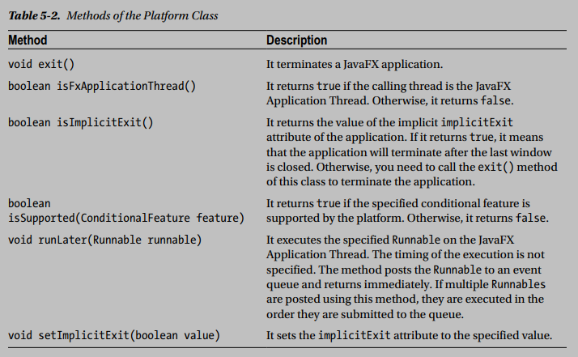
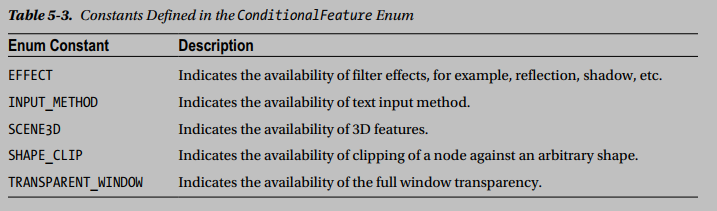

## Notes

*  A Scene object is attached to, at the most, one stage at a time. If an already attached scene is attached to another stage, it is first detached from the previous stage. A stage can have, at the most, one scene attached to it at any time.

* A scene contains a scene graph that consists of visual nodes. In this sense, a scene acts as a container for a scene graph. A scene graph is a tree data structure whose elements are known as nodes.

* A Group is a non-resizable Parent node that can be set as the root node of a scene. If a Group is the root node of a scene, the content of the scene graph is clipped by the size of the scene. If the scene is resized, the scene graph is not laid out again.

* Classes that are subclasses of the Node class, but not the Parent class, represent leaf nodes, for example, Rectangle, Circle, Text, Canvas, or ImageView.

* Only one node in a scene can be the focus owner. The focusOwner property of the Scene class tracks the Node class that has the focus. Note that the focusOwner property is read-only. If you want a specific node in a scene to be the focus owner, you need to call the ```requestFocus()``` method of the Node class. It is important to understand the distinction between a focus owner and a node having focus.

##### Understanding the Platform Class

  

1. The Platform class in the javafx.application package is a utility class used to support platform-related functionalities. It consists of all static methods, which are listed in Table 5-2.

1. Use the ```Platform.runLater()``` method to execute a task that is created on a thread other than the JavaFX Application Thread but needs to run on the JavaFX Application Thread.

1. Some features in a JavaFX implementation are optional (or conditional). They may not be available on all platforms. Using an optional feature on a platform that does not support the feature does not result in an error; the optional feature is simply ignored. Optional features are defined as enum constants in the ```ConditionalFeature``` enum in the javafx.application package, as listed in Table 5-3.

    

    Suppose your JavaFX application uses 3D GUI on user demand. You can write your logic for enabling 3D features as shown in the following code:

    ```java
    import javafx.application.Platform;
    import static javafx.application.ConditionalFeature.SCENE3D;
    ...
    if (Platform.isSupported(SCENE3D)) {
    // Enable 3D features
    }
    else {
    // Notify the user that 3D features are not available
    }
    ```


##### Knowing the Host Environment

1. The HostServices class in the javafx.application package provides services related to the launching environment (desktop, web browser, or WebStart) hosting the JavaFX application. You cannot create an instance of the HostServices class directly. The ```getHostServices()``` method of the Application class returns an instance of the HostServices class.
